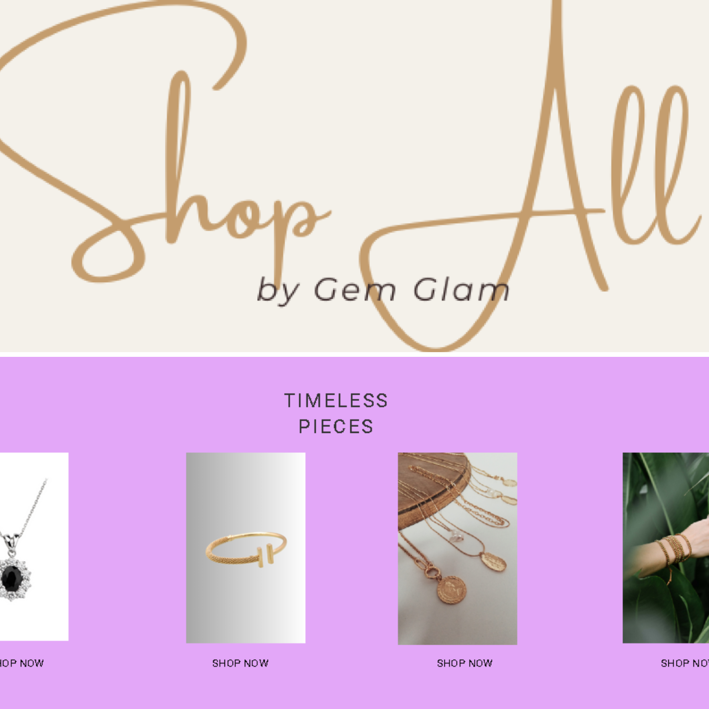
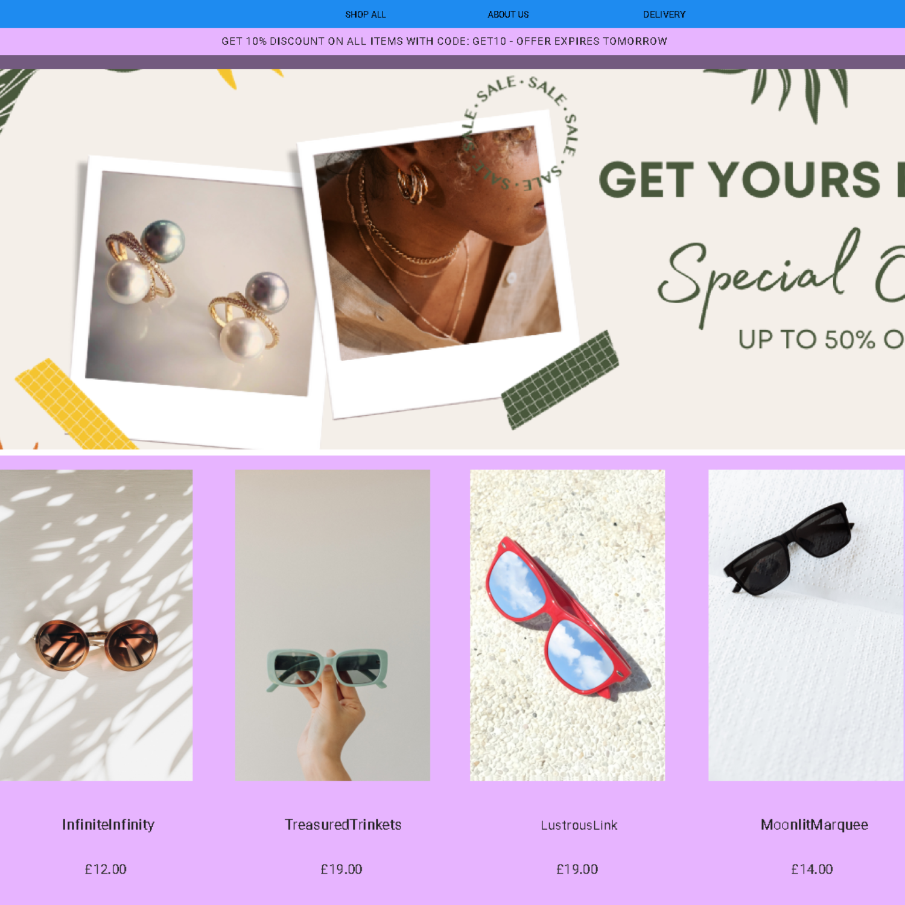
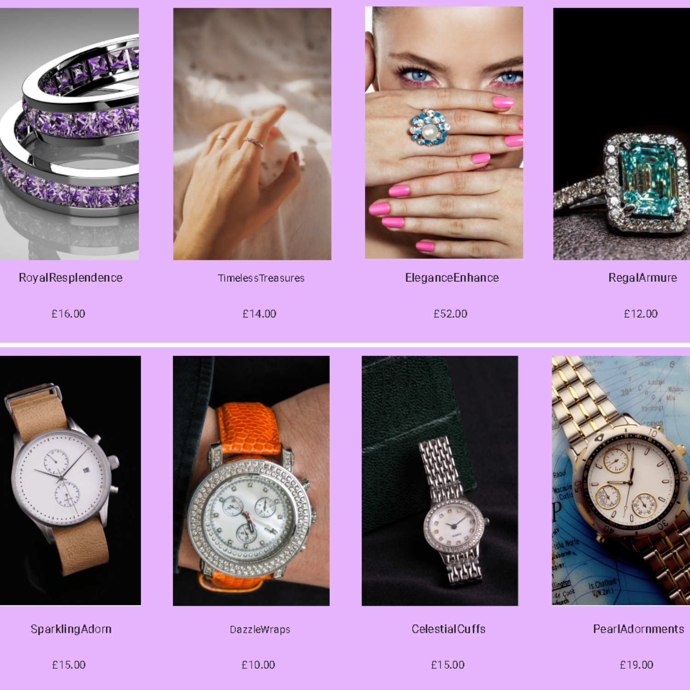
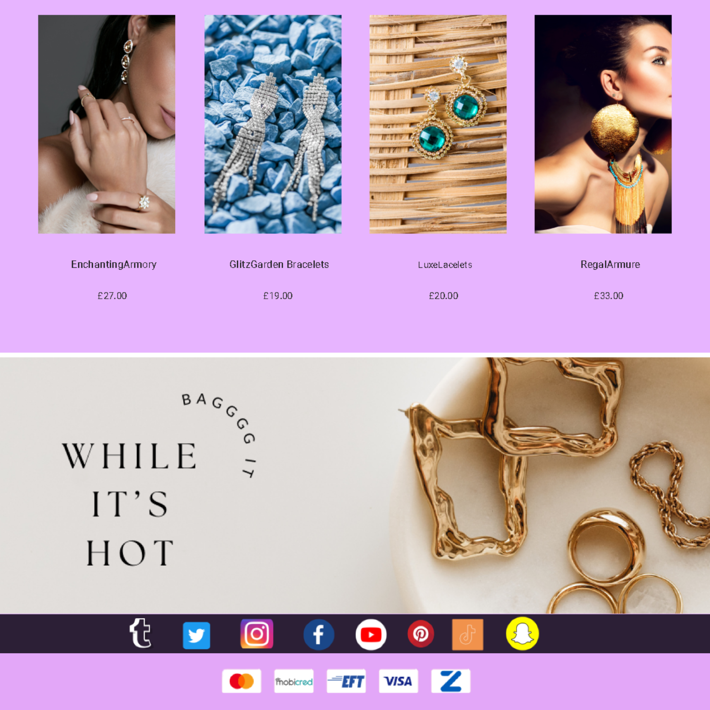
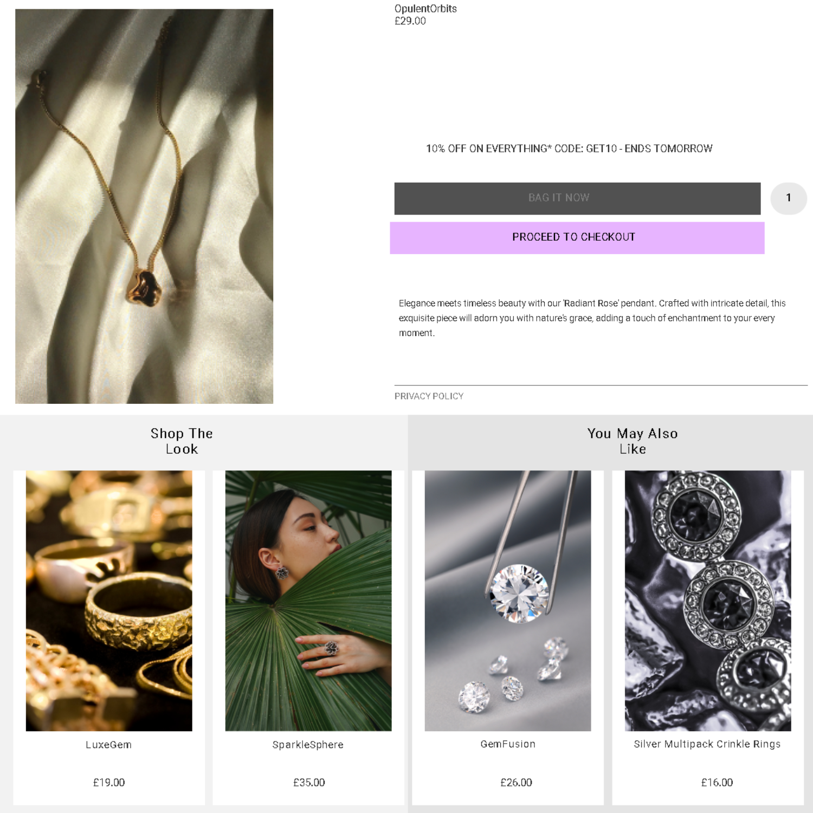

# GemGlam Website

Welcome to our jewelry store GemGlam website! 🛍️ This site showcases a variety of exquisite jewelry products, offering users a seamless shopping experience. Explore our collection and enjoy a fully responsive design for optimal display across different devices.

## Pages

### Landing Page
- 🌐 The landing page is crafted to fit content to various screens, providing an attractive introduction to our stunning jewelry collection.




### Product Page
- 💍 The product page features a dazzling array of jewelry items. Click on each product image to start shopping.





### Cart Page
- 🛒 The cart page allows you to view and manage selected items. Easily proceed to checkout for a hassle-free purchasing process.



## Header Design

- 🎨 The header boasts an elegant logo centered for a consistent and professional appearance.
- 🛒💼 Icons for the shopping cart and user login on the right side of the header enhance user accessibility - user login under construction.

## Responsive Design

- 📱 The landing page, product, and cart pages are fully responsive, adapting seamlessly to various screen sizes for an enjoyable user experience.

## How to Use

1. **Clone Repository:**
   ```bash
   git clone https://github.com/maltsh/GemGlam.git
